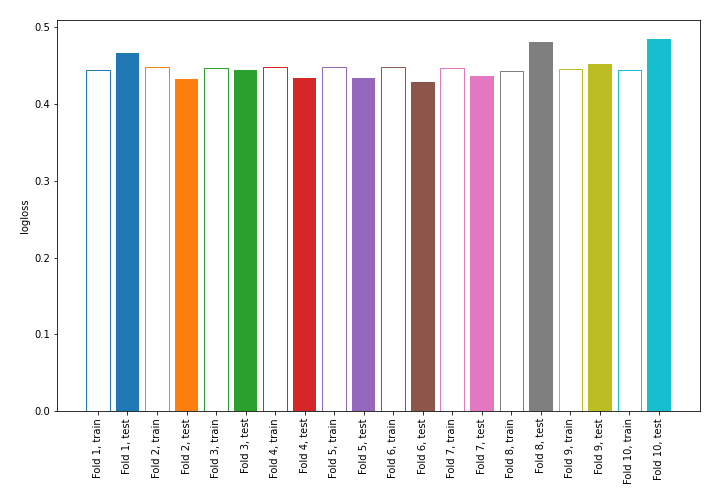

# Summary of 1_DecisionTree

## Decision Tree
- **criterion**: gini
- **max_depth**: 3
- **num_class**: 5
- **explain_level**: 0

## Validation
 - **validation_type**: kfold
 - **shuffle**: True
 - **stratify**: True
 - **k_folds**: 10

## Optimized metric
logloss

## Training time

11.4 seconds

### Metric details
|           |   not_recom |    priority |   recommend |   spec_prior |   very_recom |   accuracy |   macro avg |   weighted avg |   logloss |
|:----------|------------:|------------:|------------:|-------------:|-------------:|-----------:|------------:|---------------:|----------:|
| precision |           1 |    0.700073 |           0 |     0.777021 |            0 |   0.820907 |    0.495419 |       0.802549 |  0.449552 |
| recall    |           1 |    0.786297 |           0 |     0.747136 |            0 |   0.820907 |    0.506687 |       0.820907 |  0.449552 |
| f1-score  |           1 |    0.740684 |           0 |     0.761786 |            0 |   0.820907 |    0.500494 |       0.81082  |  0.449552 |
| support   |        1217 | 1226        |          20 |  1222        |           84 |   0.820907 | 3769        |    3769        |  0.449552 |

## Confusion matrix
|                       |   Predicted as not_recom |   Predicted as priority |   Predicted as recommend |   Predicted as spec_prior |   Predicted as very_recom |
|:----------------------|-------------------------:|------------------------:|-------------------------:|--------------------------:|--------------------------:|
| Labeled as not_recom  |                     1217 |                       0 |                        0 |                         0 |                         0 |
| Labeled as priority   |                        0 |                     964 |                        0 |                       262 |                         0 |
| Labeled as recommend  |                        0 |                      20 |                        0 |                         0 |                         0 |
| Labeled as spec_prior |                        0 |                     309 |                        0 |                       913 |                         0 |
| Labeled as very_recom |                        0 |                      84 |                        0 |                         0 |                         0 |

## Learning curves
