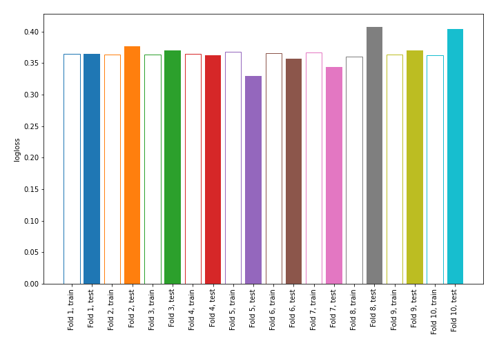

# Summary of 2_DecisionTree

## Decision Tree
- **criterion**: gini
- **max_depth**: 4
- **num_class**: 5
- **explain_level**: 0

## Validation
 - **validation_type**: kfold
 - **shuffle**: True
 - **stratify**: True
 - **k_folds**: 10

## Optimized metric
logloss

## Training time

6.7 seconds

### Metric details
|           |   not_recom |    priority |   recommend |   spec_prior |   very_recom |   accuracy |   macro avg |   weighted avg |   logloss |
|:----------|------------:|------------:|------------:|-------------:|-------------:|-----------:|------------:|---------------:|----------:|
| precision |           1 |    0.820563 |           0 |     0.750164 |            0 |   0.850093 |    0.514145 |       0.833035 |  0.368499 |
| recall    |           1 |    0.690049 |           0 |     0.933715 |            0 |   0.850093 |    0.524753 |       0.850093 |  0.368499 |
| f1-score  |           1 |    0.749668 |           0 |     0.831936 |            0 |   0.850093 |    0.516321 |       0.836487 |  0.368499 |
| support   |        1217 | 1226        |          20 |  1222        |           84 |   0.850093 | 3769        |    3769        |  0.368499 |

## Confusion matrix
|                       |   Predicted as not_recom |   Predicted as priority |   Predicted as recommend |   Predicted as spec_prior |   Predicted as very_recom |
|:----------------------|-------------------------:|------------------------:|-------------------------:|--------------------------:|--------------------------:|
| Labeled as not_recom  |                     1217 |                       0 |                        0 |                         0 |                         0 |
| Labeled as priority   |                        0 |                     846 |                        0 |                       380 |                         0 |
| Labeled as recommend  |                        0 |                      20 |                        0 |                         0 |                         0 |
| Labeled as spec_prior |                        0 |                      81 |                        0 |                      1141 |                         0 |
| Labeled as very_recom |                        0 |                      84 |                        0 |                         0 |                         0 |

## Learning curves
